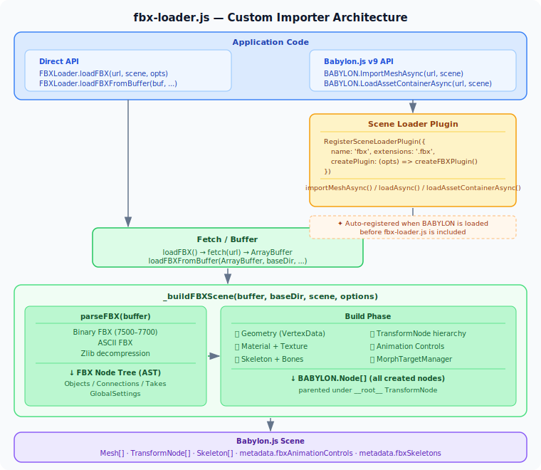

# fbx-test

The status of loading and viewing FBX models using different WebGL libraries.

## Samples

- [Three.js + FBXLoader](https://cx20.github.io/fbx-test/example/threejs/index.html)
- [Babylon.js + custom FBX loader](https://cx20.github.io/fbx-test/example/babylonjs/index.html)

## FBX Models

Test environment: Windows 11 + Chrome 147

Legend:

- :white_check_mark: Displayed
- :warning: Partially displayed / work in progress
- :x: Not supported by the current sample

| Model | [Three.js r184](https://github.com/mrdoob/three.js) | [Babylon.js custom loader](example/babylonjs/fbx-loader.js) | Notes |
|---|---|---|---|
| [Samba Dancing](assets/models/fbx/Samba%20Dancing.fbx) | :white_check_mark: [Sample](https://cx20.github.io/fbx-test/example/threejs/index.html?model=Samba%20Dancing) | :white_check_mark: [Sample](https://cx20.github.io/fbx-test/example/babylonjs/index.html?model=Samba%20Dancing) | Skinned animation model. |
| [morph_test](assets/models/fbx/morph_test.fbx) | :white_check_mark: [Sample](https://cx20.github.io/fbx-test/example/threejs/index.html?model=morph_test) | :white_check_mark: [Sample](https://cx20.github.io/fbx-test/example/babylonjs/index.html?model=morph_test) | Morph targets. Adjust influence in the **Morphs** folder of the GUI. |
| [monkey](assets/models/fbx/monkey.fbx) | :white_check_mark: [Sample](https://cx20.github.io/fbx-test/example/threejs/index.html?model=monkey) | :white_check_mark: [Sample](https://cx20.github.io/fbx-test/example/babylonjs/index.html?model=monkey) | Static mesh. |
| [monkey_embedded_texture](assets/models/fbx/monkey_embedded_texture.fbx) | :white_check_mark: [Sample](https://cx20.github.io/fbx-test/example/threejs/index.html?model=monkey_embedded_texture) | :white_check_mark: [Sample](https://cx20.github.io/fbx-test/example/babylonjs/index.html?model=monkey_embedded_texture) | Embedded texture. |
| [vCube](assets/models/fbx/vCube.fbx) | :white_check_mark: [Sample](https://cx20.github.io/fbx-test/example/threejs/index.html?model=vCube) | :white_check_mark: [Sample](https://cx20.github.io/fbx-test/example/babylonjs/index.html?model=vCube) | Static mesh. |
| [archer/ArcherRi01](assets/models/fbx/archer/ArcherRi01.fbx) | :white_check_mark: [Sample](https://cx20.github.io/fbx-test/example/threejs/index.html?model=archer/ArcherRi01) | :white_check_mark: [Sample](https://cx20.github.io/fbx-test/example/babylonjs/index.html?model=archer/ArcherRi01) | Static mesh with geometric transform. |
| [warrior/Warrior](assets/models/fbx/warrior/Warrior.fbx) | :white_check_mark: [Sample](https://cx20.github.io/fbx-test/example/threejs/index.html?model=warrior/Warrior) | :warning: [Sample](https://cx20.github.io/fbx-test/example/babylonjs/index.html?model=warrior/Warrior) | Skinned animation model. ByVertice UV/normal mapping fix applied. |
| [stanford-bunny](assets/models/fbx/stanford-bunny.fbx) | :white_check_mark: [Sample](https://cx20.github.io/fbx-test/example/threejs/index.html?model=stanford-bunny) | :white_check_mark: [Sample](https://cx20.github.io/fbx-test/example/babylonjs/index.html?model=stanford-bunny) | Large static mesh (ASCII FBX format). |
| [mixamo](assets/models/fbx/mixamo.fbx) | :white_check_mark: [Sample](https://cx20.github.io/fbx-test/example/threejs/index.html?model=mixamo) | :white_check_mark: [Sample](https://cx20.github.io/fbx-test/example/babylonjs/index.html?model=mixamo) | Skinned animation model. |
| [RotationTest](assets/models/fbx/RotationTest.fbx) | :white_check_mark: [Sample](https://cx20.github.io/fbx-test/example/threejs/index.html?model=RotationTest) | :warning: [Sample](https://cx20.github.io/fbx-test/example/babylonjs/index.html?model=RotationTest) | Rotation-order coverage is still being verified. |
| [exampleWindow](assets/models/fbx/exampleWindow.fbx) | :white_check_mark: [Sample](https://cx20.github.io/fbx-test/example/threejs/index.html?model=exampleWindow) | :white_check_mark: [Sample](https://cx20.github.io/fbx-test/example/babylonjs/index.html?model=exampleWindow) | Static mesh. |
| [Head_69](assets/models/fbx/Head_69.fbx) | :white_check_mark: [Sample](https://cx20.github.io/fbx-test/example/threejs/index.html?model=Head_69) | :white_check_mark: [Sample](https://cx20.github.io/fbx-test/example/babylonjs/index.html?model=Head_69) | Static mesh with multi-material support. |
| [morph-translation](assets/models/fbx/morph-translation.fbx) | :white_check_mark: [Sample](https://cx20.github.io/fbx-test/example/threejs/index.html?model=morph-translation) | :white_check_mark: [Sample](https://cx20.github.io/fbx-test/example/babylonjs/index.html?model=morph-translation) | Morph targets (8 meshes). Adjust influence in the **Morphs** folder of the GUI. |

## fbx-loader.js Usage

A standalone binary and ASCII FBX parser and Babylon.js mesh builder. No build step or npm install required — just include it as a `<script>` tag.

### Architecture



### Installation

```html
<script src="example/babylonjs/fbx-loader.js"></script>
```

### API

#### `FBXLoader.loadFBX(url, scene, options)` — Load from URL

```js
const nodes = await FBXLoader.loadFBX(url, scene, options);
```

| Parameter | Type | Description |
|---|---|---|
| `url` | `string` | URL of the `.fbx` file to load |
| `scene` | `BABYLON.Scene` | Target Babylon.js scene |
| `options` | `object` | Optional settings (see below) |

**Returns:** `Promise<BABYLON.Node[]>` — all created nodes (meshes and transform nodes).

#### `FBXLoader.loadFBXFromBuffer(buffer, baseDir, scene, options)` — Load from ArrayBuffer

```js
const nodes = await FBXLoader.loadFBXFromBuffer(buffer, baseDir, scene, options);
```

| Parameter | Type | Description |
|---|---|---|
| `buffer` | `ArrayBuffer` | Raw FBX file data |
| `baseDir` | `string` | Base URL for resolving relative texture paths (e.g. `"assets/models/"`) |
| `scene` | `BABYLON.Scene` | Target Babylon.js scene |
| `options` | `object` | Optional settings (see below) |

#### Options

| Option | Type | Default | Description |
|---|---|---|---|
| `animation` | `boolean` | `true` | Start animation playback automatically |
| `animationTime` | `number` | `0` | Initial animation time in seconds |

### Babylon.js Scene Loader Plugin

`fbx-loader.js` automatically registers itself as a Babylon.js Scene Loader Plugin when included, enabling the standard scene loader API for `.fbx` files.

```js
// Babylon.js v9+: pass a single full URL
const result = await BABYLON.ImportMeshAsync('https://example.com/assets/model.fbx', scene);
console.log(result.meshes);      // BABYLON.Mesh[]
console.log(result.skeletons);   // BABYLON.Skeleton[]

// Load into an AssetContainer (can be added/removed from scene later)
const container = await BABYLON.LoadAssetContainerAsync('https://example.com/assets/model.fbx', scene);
container.addAllToScene();
```

Loader options can be passed via `pluginOptions`:

```js
const result = await BABYLON.ImportMeshAsync('https://example.com/assets/model.fbx', scene, {
    pluginOptions: { fbx: { animation: false, animationTime: 2.0 } },
});
```

To register manually, use `FBXLoader.createPlugin()`:

```js
BABYLON.RegisterSceneLoaderPlugin({
    name: 'fbx',
    extensions: '.fbx',
    createPlugin: (opts) => FBXLoader.createPlugin(opts?.fbx ?? {}),
});
```

#### Babylon.js v8 and earlier

For Babylon.js v8 and earlier, use the `SceneLoader` class methods with a split `rootUrl` + `fileName`:

```js
const result = await BABYLON.SceneLoader.ImportMeshAsync('', 'https://example.com/assets/', 'model.fbx', scene);
```

### Animation Control

When a skinned animation is present, the root node's `metadata.fbxAnimationControls` contains an array of animation control objects.

```js
const nodes = await FBXLoader.loadFBX(url, scene);

// Find the root node (__root__)
const root = nodes.find(n => n.name === '__root__');
const controls = root?.metadata?.fbxAnimationControls ?? [];

// Each control exposes:
const ctrl = controls[0];
ctrl.name;              // animation stack name (string)
ctrl.duration;          // total duration in seconds (number)
ctrl.time;              // current playback time (number)
ctrl.playing;           // true if playing (boolean)
ctrl.setTime(t);        // seek to time t (seconds)
ctrl.setPlaying(bool);  // play or pause
ctrl.dispose();         // clean up observer when done
```

The root node's `metadata.fbxSkeletons` contains an array of `BABYLON.Skeleton` objects for the loaded model.

### Basic Example

```html
<!DOCTYPE html>
<html>
<head>
  <script src="https://cdn.babylonjs.com/babylon.js"></script>
  <script src="fbx-loader.js"></script>
</head>
<body>
  <canvas id="c" style="width:100%;height:100vh"></canvas>
  <script>
    const canvas = document.getElementById('c');
    const engine = new BABYLON.Engine(canvas, true);
    const scene = new BABYLON.Scene(engine);

    const camera = new BABYLON.ArcRotateCamera('cam', -Math.PI / 2, Math.PI / 2.5, 5, BABYLON.Vector3.Zero(), scene);
    camera.attachControl(canvas, true);
    new BABYLON.HemisphericLight('light', new BABYLON.Vector3(0, 1, 0), scene);

    // Direct load via FBXLoader.loadFBX
    FBXLoader.loadFBX('model.fbx', scene, { animation: true }).then(nodes => {
        console.log('Loaded nodes:', nodes.length);
    });

    // Or via the Scene Loader Plugin (auto-registered when fbx-loader.js is included)
    // await BABYLON.ImportMeshAsync('https://example.com/model.fbx', scene);  // v9+
    // await BABYLON.SceneLoader.ImportMeshAsync('', '', 'model.fbx', scene);  // v8

    engine.runRenderLoop(() => scene.render());
    window.addEventListener('resize', () => engine.resize());
  </script>
</body>
</html>
```

### URL Query Parameters (example viewer)

The [example viewer](example/babylonjs/index.html) also accepts these query parameters:

| Parameter | Example | Description |
|---|---|---|
| `model` | `?model=monkey` | Select a bundled model by name |
| `url` | `?url=https://…/model.fbx` | Load an arbitrary FBX URL |
| `scale` | `?scale=0.01` | Override the model scale |
| `animation` | `?animation=0` | Disable auto-play (`0` / `false` / `off`) |
| `time` | `?time=1.5` | Set the initial animation time (seconds) |

## Current Babylon.js Loader Scope

The Babylon.js sample uses a custom FBX parser supporting both binary and ASCII formats. It currently focuses on static mesh loading, transform hierarchy validation, basic skinning data, and sampled skeleton animation.

Supported or partially supported:

- Binary and ASCII FBX parsing
- Mesh geometry
- Normals, UVs, vertex colors
- Basic materials and external diffuse textures
- Model hierarchy transforms
- FBX geometric transforms
- Basic skinning: Skin/Cluster deformers, skeleton bones, and vertex bone weights
- Basic sampled skeleton animation: AnimationStack, AnimationLayer, AnimationCurveNode, and AnimationCurve
- Morph targets (BlendShape / BlendShapeChannel / Shape) with `DeformPercent` animation. In-between shapes (multi-`FullWeights`) currently use only the final shape.
