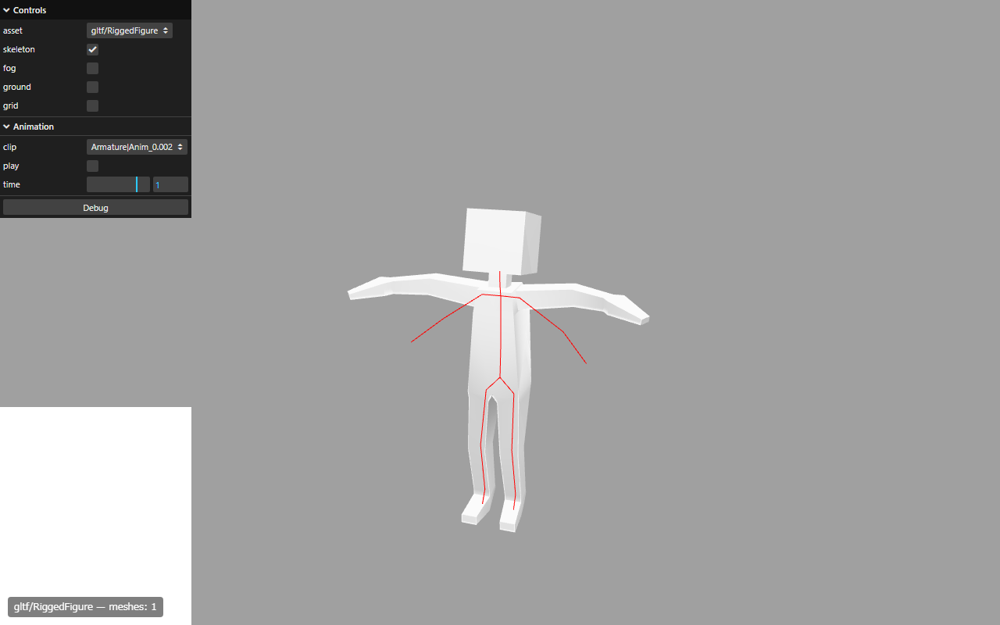
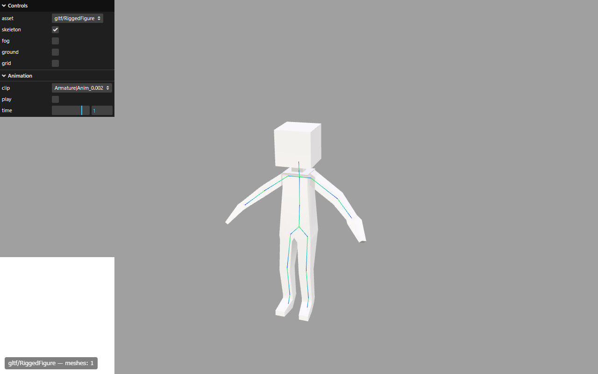

# Babylon.js viewer — developer notes

This file documents known issues, investigation history, and useful entry points
for anyone working on [`fbx-loader.js`](fbx-loader.js).

For end-user API/usage, see the [top-level README](../../README.md).

---

## Known issues

### 1. Shoulder ROM (range of motion) mismatch on `gltf/RiggedFigure`

**Symptom.** With the `Armature|Anim_0.002` clip at non-zero animation times,
the arms in the Babylon.js viewer stay nearly horizontal (T-pose-like), whereas
the Three.js viewer correctly drops them to an A-pose angle. The legs and torso
look approximately correct; only the shoulder rotation diverges.

| Babylon.js (current) | Three.js (reference) |
|---|---|
|  |  |
| Arms held horizontal; the bones drawn by `BABYLON.Debug.SkeletonViewer` (red) match the Three.js positions, so the bone *hierarchy* is correct — only the mesh skinning fails to track the shoulder rotation. | Arms angled downward as the animation intends (the clip oscillates the shoulder rotation around `Rz`). |

**Reproduction.**

```
?model=gltf/RiggedFigure&animation=0&time=1.0&clip=Armature%7CAnim_0.002&fog=0&ground=0&grid=0&skeleton=1
```

Compare side-by-side using `scripts/compare_viewers.js` (headless Playwright).

**Root cause (analysis).**

The FBX `TransformLink` (bind pose) for `arm_joint_L_1` does **not** match the
node's `Properties70 LclRotation` (which encodes the file's current pose, used
by Babylon.js when deriving the auto-computed inverse-bind matrix).

| Bone | Properties70 R | Animation curve at t=0 |
|------|----------------|-----------------------|
| `arm_joint_L_1` (Rx) | `−112.10°` | `−110.73°` |
| `arm_joint_L_1` (Ry) | `13.85°` | `13.94°` |
| `arm_joint_L_1` (Rz) | `91.75°` | `91.71°` |

The small per-bone deltas accumulate along the chain. For simple models like
`gltf/SimpleSkin` the discrepancy is barely visible; for `gltf/RiggedFigure`,
the long arm lever amplifies it into the observed shoulder ROM mismatch.

`fbx-loader.js` already sets [`bone._invertedAbsoluteTransform = invTL`](fbx-loader.js)
(line ~976) to override the auto-computed inv-bind with the FBX `TransformLink`.
The issue is **not** that this override is a no-op — empirically, SimpleSkin
matches Three.js closely with the override in place. The deeper problem is
described next.

**Why the obvious fixes don't work.**

The Babylon.js GPU skinning formula is:

```
world_vertex = mesh.world × GPU × position
GPU          = bone._absoluteMatrix × bone._invertedAbsoluteTransform
             = chain_t × inv_bind                          (BJS standard product)
```

For `RiggedFigure`, the **mesh node itself** carries the `Z_UP`-equivalent
transform (`Rx(180°)`, `S=100`) in its `Properties70`, so `mesh.world ≈ Z_UP`.
Meanwhile, the BJS bone chain (`bone._absoluteMatrix`) starts from the
`torso_joint_1` root bone and does **not** include `Z_UP` or `Armature`.

Working out what the correct `GPU` must be so that `mesh.world × GPU × position`
gives the same final world position as the FBX skinning formula
(`TL_t × inv(TL_bind) × Z_UP × position`):

```
GPU_correct = inv(Z_UP) × TL_t × inv(TL_bind) × Z_UP
            = chain_t × inv(chain_bind)                    (pure delta)
```

So we need `inv_bind = inv(chain_bind)` (the Properties70-derived bind, WITHOUT
the `Z_UP` ancestor factor) — i.e. the bone-chain coordinate space, not the FBX
world space.

But `invTL = inv(Z_UP × chain_bind) = inv(chain_bind) × inv(Z_UP)`. So the
current code's `inv_bind = invTL` is **off by `inv(Z_UP)`** in the right-side
position. The visible result happens to be close to correct because
`mesh.world × inv(Z_UP)` partially cancels — but only in the rotation block;
the bind-pose mismatch (`Properties70 ≠ TL_bind`) leaks through as a constant
rotational offset for each bone.

**Approaches tried (none successful).**

| # | Approach | Result |
|---|----------|--------|
| 1 | Synthetic root bone with `Z_UP × Armature` local matrix | Mesh blows up to 100× scale or twists 90°, because `mesh.world` already includes `Z_UP` — adding it to the bone chain double-counts it |
| 2 | `inv_bind = ancestor.multiplyToRef(invTL, result)` (i.e. `invTL × ancestorMatrix` in BJS standard product, which strips `Z_UP` from `invTL`) | SimpleSkin keeps working, but RiggedFigure shoulder is unchanged — the math reduces to the master state in a different decomposition |
| 3 | (Not tried) `mesh.setPoseMatrix(...)` + `skeleton.needInitialSkinMatrix = true` to route through BJS's per-mesh skin-matrix path | Hypothetical — may give us a place to inject the `Z_UP` correction without double-counting |

The fundamental issue is that with `mesh.world ≠ identity`, no **constant**
`inv_bind` matrix can make the BJS formula `mesh.world × abs × inv_bind`
algebraically equal to the Three.js formula `delta × mesh.world` (the
`Z_UP`-cancelling term would have to depend on `chain_t`, which varies per
frame).

**Promising directions for a real fix.**

1. **Use the BJS per-mesh skin-matrix path.** Set `skeleton.needInitialSkinMatrix = true`
   and pass `mesh.getPoseMatrix()` such that the bone chain's effective `abs_t`
   contributes the `Z_UP` factor *inside* the GPU matrix (instead of outside via
   `mesh.world`). This is the most "BJS-idiomatic" fix.

2. **Re-parent the mesh.** Put the `Z_UP × Armature` transform on a parent
   `TransformNode` so that the mesh node itself can carry identity. Then add a
   synthetic root bone with the same transform, and the bone chain naturally
   matches the FBX `TransformLink` space. The mesh's `world` would then equal
   the synthetic root bone's absolute, and the math collapses cleanly.
   Watch out for double-application bugs when `mesh.parent` and the synthetic
   bone both pick up the same scene-graph transform.

3. **Bake `Z_UP` into the vertex data at load time.** Transform every vertex by
   `Z_UP` and zero out the mesh's local transform. Simplest math, but loses the
   distinction between mesh transform and geometry — may surprise users who
   expect `mesh.position` etc. to behave like an FBX hierarchy node.

Of these, (1) is least invasive but requires deeper BJS internals knowledge;
(2) is most architecturally clean.

---

## How to investigate

### Headless side-by-side comparison

A Playwright script (`scripts/compare_viewers.js`, currently untracked) captures
screenshots of both viewers under matching URL parameters:

```bash
node scripts/compare_viewers.js gltf/RiggedFigure 1.0 "Armature|Anim_0.002"
# Output: scripts/screenshots/babylonjs.png and threejs.png
```

The viewers expose URL params (`fog=0&ground=0&grid=0&skeleton=1`) specifically
to make these comparisons deterministic. The `skeleton=1` flag enables
`BABYLON.Debug.SkeletonViewer` (red) in BJS and `THREE.SkeletonHelper` (blue→green
gradient) in Three.js — invaluable for separating "mesh bug" from "bone bug".

### Useful FBX inspection scripts

Several diagnostic scripts have been written during investigation (also
currently untracked under `scripts/`):

- `analyze_simpleskin.py` / `analyze_simpleskin_anim.py` — dump model structure
  and animation curves for `gltf/SimpleSkin`
- `check_arm_anim.py` — dump animation curves for `arm_joint_L_1` in the
  `Armature|Anim_0.002` clip of `RiggedFigure`
- `check_props70_vs_tl.py` — compare the world matrix derived from the
  `Properties70` chain (including `Z_UP`) against the FBX `TransformLink`
- `check_hierarchy_vs_tl.py` — same comparison using animation-curve values at
  `t=0` instead of `Properties70`
- `check_torso_anim.py` — list all bones that carry animation channels in a
  given stack, useful for spotting missing bridge bones

### Key code locations

- [`fbx-loader.js:469` (`fbxEulerToQuat`)](fbx-loader.js#L469) — FBX RH → BJS LH
  Euler-to-quaternion conversion (negates Rx/Ry, keeps Rz)
- [`fbx-loader.js:536` (`makeBabylonLocalMatrixFromTransform`)](fbx-loader.js#L536) —
  builds the BJS local matrix from FBX `T/R/S/preR/rotOrder`
- [`fbx-loader.js:551` (`fbxTransformLinkToBabylon`)](fbx-loader.js#L551) —
  converts the FBX `TransformLink` (column-major, RH) to a BJS matrix
- [`fbx-loader.js:883` (`createSkeletonForSkin`)](fbx-loader.js#L883) — bone
  hierarchy construction. **Line 976** is where the inv-bind override happens.
- [`fbx-loader.js:1113` (`applySkeletonAnimation`)](fbx-loader.js#L1113) — runs
  every frame; samples `T/R/S` curves and calls `bone.updateMatrix(...)`
- [`fbx-loader.js:1477` (`createSkeletonTransformNodes`)](fbx-loader.js#L1477) —
  builds the `TransformNode` ↔ `Bone` linkage that `Skeleton.prepare()` consumes

### Babylon.js conventions (verified empirically)

- BJS `Matrix` uses **column-major storage** + **column-vector** application
  (`Vector3.TransformCoordinates(v, M)` computes `M * v`).
- `A.multiplyToRef(B, result)` produces `result_data = B × A` in standard
  column-vector matrix product — i.e. the resulting matrix represents the
  composition "**first** apply A, **then** apply B" operationally.
  Verified by: `T(1,0,0).multiplyToRef(RotZ(90°), r); r * (1,0,0) → (0,2,0)`.
- BJS bone hierarchy computes
  `child._absoluteMatrix = child._localMatrix.multiplyToRef(parent._absoluteMatrix, child._absoluteMatrix)`,
  which means `child_abs_data = parent_abs × child_local` (standard product),
  which when applied to a vector in child-local space first transforms by
  `child_local` (→ parent-local) then by `parent_abs` (→ world). ✓
- The BJS build used by this repo
  (`https://cx20.github.io/gltf-test/libs/babylonjs/dev/babylon.js`) still
  recognises **`bone._invertedAbsoluteTransform`** as the inverse-bind field
  name; the newer field name is `_absoluteInverseBindMatrix`. SimpleSkin
  renders close to Three.js with `_invertedAbsoluteTransform` set, so for the
  current dev build it is **not** a no-op.

### FBX skinning math reference

For a bone `b` and a vertex `v` in mesh-local space, the standard FBX skinning
output (in world space) is:

```
v_world(t) = Σ_b w_b · TransformLink_b(t) · Transform_b⁻¹ · v
           ≈ Σ_b w_b · TL_b(t) · inv(TL_b_bind) · v
```

where `TL_b(t)` is the bone's world transform at time `t`, and `Transform_b`
(usually equal to `TL_b_bind`) is the bone's world transform at the moment the
skin was created. For Blender-exported FBX, `TL_b_bind` is the **T-pose**
(rest pose); `Properties70` may encode a **different** pose (whatever the rig
was in when the FBX was exported), which is the source of the bind-pose
mismatch documented above.

The mesh's own model transform (`mesh.world`) brings vertices from mesh-local
to FBX world space. The combined render pipeline is then renderer-specific
(Three.js's "attached bind mode" cancels `mesh.world` inside the shader using
`bindMatrix` / `bindMatrixInverse`; Babylon.js applies `mesh.world` outside the
bone matrix).

---

## Conventions for new investigations

- Add new diagnostic scripts under `scripts/` (currently `.gitignore`-clean,
  not committed by default).
- When comparing viewers, **always** match the `clip=` parameter explicitly —
  the two viewers default to different clips when none is specified
  (BJS picks the first stack, Three.js picks `Anim_0.002` when present).
- Disable `fog`, `ground`, and `grid` for screenshot diffs (URL params).
- If a candidate fix breaks `gltf/SimpleSkin` (the simplest skinned model), it
  almost certainly breaks heavier models too — use it as a smoke test.
